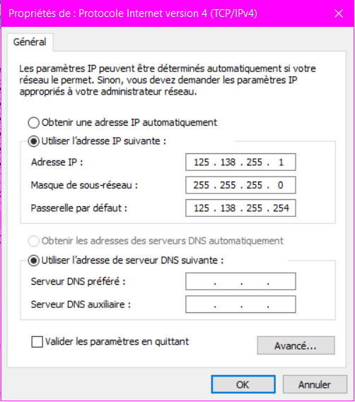

## Exploration locale en duo.

### 1) & 2) Prérequis et Câblage.

Nous avons branché les ordinateurs de Remi FEYDIT et Louis MAURY à l'aide d'un cable RJ45.

### 3) Modification d'adresse IP

*    
        

*    
    

*    
    
    
Le plus petit réseau possible est un /30 car     nous n'avons pas de passerelle dans le     réseau, on ne peut donc mettre que nos deux machines.

### 4) Utilisation de l'un des deux comme gateway

Nous avons désactivé la carte wi-fi du PC de Rémi (alias Notitou), et avons utilisé le PC de Louis comme gateway.


Voilà le `nslookup` pour assurer la connexion internet :
```powershell
PS C:\Users\Notitou> nslookup.exe google.com
DNS request timed out.
    timeout was 2 seconds.
Serveur :   UnKnown
Address:  8.8.8.8

Réponse ne faisant pas autorité :
Nom :    google.com
Addresses:  2a00:1450:4007:817::200e
          216.58.206.238
```

### 5) Petit Chat privé ?

Louis a joué le rôle du serveur et Rémi celui du client :


### 6) Wireshark

Screen de Wireshark durant un netcat


Screen de Wireshark pendant un ping


## III. Manipulations d'autres outils/protocoles côté client

### 1. DHCP

```
ip DHCP : DUID de client DHCPv6. . . . . . . . : 00-01-00-01-1E-80-9C-1F-70-5A-0F-1E-E0-1E
date expiration :    Bail expirant. . . . . . . . . . . . . : lundi 7 janvier 2019 12:00:15
```

```
ipconfig /release
Carte réseau sans fil Wi-Fi :

   Suffixe DNS propre à la connexion. . . :
   Adresse IPv6 de liaison locale. . . . .: fe80::d19:1061:a4be:fb60%10
   Passerelle par défaut. . . . . . . . . :

ipconfig /renew
Carte réseau sans fil Wi-Fi :

   Suffixe DNS propre à la connexion. . . : auvence.co
   Adresse IPv6 de liaison locale. . . . .: fe80::d19:1061:a4be:fb60%10
   Adresse IPv4. . . . . . . . . . . . . .: 10.33.3.104
   Masque de sous-réseau. . . . . . . . . : 255.255.252.0
   Passerelle par défaut. . . . . . . . . : 10.33.3.253
```

### 2. DNS

```
ipconfig /all
Carte réseau sans fil Wi-Fi :

   Serveurs DNS. . .  . . . . . . . . . . : 10.33.10.20
                                       10.33.10.7
                                       8.8.8.8
````

```
PS C:\Users\Irohn> nslookup google.com
Serveur :   UnKnown
Address:  10.33.10.20

Réponse ne faisant pas autorité :
Nom :    google.com
Addresses:  2a00:1450:4007:80e::200e
          216.58.208.238

PS C:\Users\Irohn> nslookup ynov.com
Serveur :   UnKnown
Address:  10.33.10.20

Réponse ne faisant pas autorité :
Nom :    ynov.com
Address:  217.70.184.38

PS C:\Users\Irohn> nslookup reverse 78.78.21.21
DNS request timed out.
    timeout was 2 seconds.
Serveur :   UnKnown
Address:  78.78.21.21

DNS request timed out.
    timeout was 2 seconds.
DNS request timed out.
    timeout was 2 seconds.
*** Le délai de la requête sur UnKnown est dépassé.

PS C:\Users\Irohn> nslookup reverse 92.16.54.88
DNS request timed out.
    timeout was 2 seconds.
Serveur :   UnKnown
Address:  92.16.54.88

DNS request timed out.
    timeout was 2 seconds.
DNS request timed out.
    timeout was 2 seconds.
*** Le délai de la requête sur UnKnown est dépassé.
```

